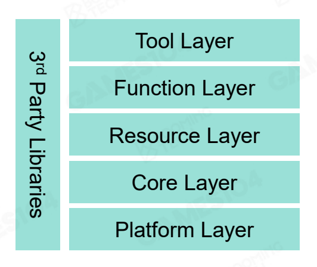

## 104hw1  
这回读一读框架代码就行了 下面就简单描述一下程序结构  
顺带提醒一下 这回克隆仓库的时候记得选第一个作业对应标签的版本 更新版的代码恐怕会复杂许多  
### 结构  
在VS内打开解决方案的话能看到其实有16个项目（有点吓人） 但其实很多根本就不需要我们关心  
仔细看解决方案资源管理器的话能看出我们只要了解一下Engine分类下的内容即可 这里又分出了四个部分（不知道该怎么叫了） 再仔细看就能发现只需要研究PilotEditor以及PilotRuntime  
Editor为游戏场景编辑器 其下不再分小模块 Runtime为游戏引擎内核 其下又分为四个小模块 小模块里还套着更小的功能点  
这么多文件该怎么研究呢 其实还是祭出这张图片好了  

借着课上提出的分层架构模型来看的话 我们可以一点点来看这些文件 如果我们观察一下就能发现 项目中对这五层的分工实际上是比较分离的 Tool可以简单的认为只有Editor中提供的编辑器 剩下四层在Runtime中刚好各有一个文件夹 这样一来我们就可以有章法的看这些文件了  
受到某本黑皮书的启发 我们可以先从最顶层开始看 然后逐步向下前进 我称之为游戏引擎架构：自顶向下方法  
### Tool layer  
警告：下面可能是漫长的顺藤摸瓜环节  
第一眼看到的最亲切的文件就是这个source/main.cpp了 果不其然内容相当简单 主体只是调用了Engine和Editor的初始化、运行与销毁函数  
Engine部分我们暂时不管 跟着来到editor.h/cpp 这俩货也很简单 基本都是调用更下层的接口 比如说这个render对象被使用了好几次 仔细一看包含的头文件就能看出来这个对象是下一层Function layer提供的  
比较大的是这货editor_ui.h/cpp 里面定义了Editor的UI界面支持的功能 下面列出来一些我觉得比较关键的：  
* `EditorUI`：构造函数看着很长但内容很同质化 就是往`m_editor_ui_creator`里塞入很多的键值对 其中key都是一些元素类型名 value则是对应的处理函数  
* `onTick`：这个函数告诉我们一件事 每个tick到来时其实对于编辑器的ui来说只要做两件事：1.刷新一次显示ui 2.处理上一个tick中产生的键盘事件  
* `showEditorUI`：这个函数的实现就是把默认打开的子窗口全都显示 子窗口的显示对应了许多函数 实现基本都调用ImGui外部库 所以不用细看  
* `processEditorCommand`：函数处理所有产生的键盘事件的逻辑 后面还有一些类似的捕获鼠标按下/滚轮等的逻辑 都不再赘述  
* `moveEntity`：这个函数处理对于物体的一切变换 可以理解为 MVP变换中的M变换产生器  

还剩下两对文件我们没有探讨 它们包含的内容比较少也比较有针对性 editor_file_service.h/cpp负责文件操作 axis.h/cpp负责坐标轴的创建移动等管理 有兴趣的可以去仔细查看实现机理  
### Function layer  
